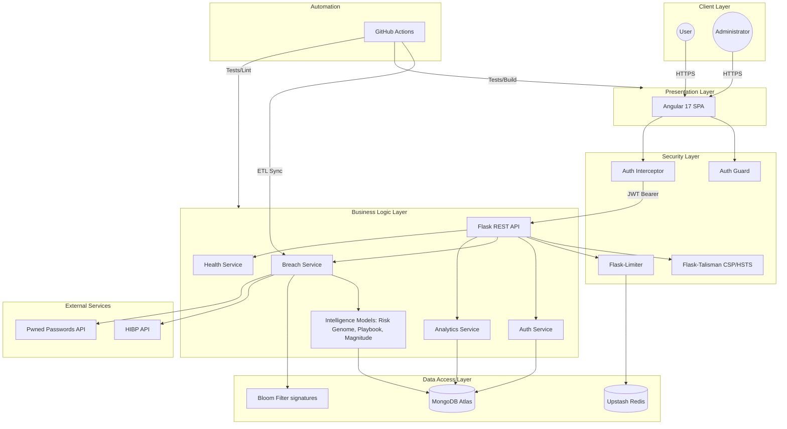

# BreachLens System Architecture

This document provides a professional overview of the BreachLens system architecture, detailing the integration between the frontend, backend, database, and external services.

## High-Level Architecture

The following Mermaid diagram illustrates the core components and data flow of the BreachLens platform.

## Architectural Components

### 1. Presentation Layer (Angular 17)
The frontend is built as a single-page application (SPA) using Angular 17, featuring standalone components and reactive signals. It handles user interactions, geospatial mapping via Leaflet.js, and data visualization via Chart.js.

### 2. Business Logic Layer (Flask REST API)
The backend is a RESTful API built with Flask, organized into Blueprints for modular routing. It implements a layered service pattern, separating HTTP handling from core business rules and data transformations.

### 3. Security Intelligence Models
A central pillar of the BreachLens architecture is its proprietary intelligence processing logic, implemented within the service layer:
- **Risk Genome Breakdown**: A metadata analysis engine that deconstructs breach data into four functional risk vectors: Identity, Credentials, Financial, and Technical.
- **Tactical Defense Playbook**: A real-time action-generation engine that ranks remediation steps (Critical to Medium) based on the specific DNA of a user's exposure.
- **Threat Magnitude Benchmarking**: A normalized scoring algorithm (0-10) that converts raw breach metrics into a simplified threat projection.

### 4. Security & Middleware
The system employs multiple layers of security:
- **Authentication**: JWT-based Bearer token authentication with automated TTL-based revocation.
- **Authorization**: Role-Based Access Control (RBAC) with Admin, Analyst, and Guest roles.
- **Protection**: Input sanitization against NoSQL injection and XSS, and security headers (CSP, HSTS) enforced via Flask-Talisman.
- **Rate Limiting**: Distributed rate limiting integrated with Upstash Redis to prevent brute-force attacks.

### 5. Data Layer (MongoDB & Redis)
- **Primary Store**: MongoDB Atlas (v7.0) handles breach data, user profiles, and audit logs.
- **Caching & Limiting**: Upstash Redis manages distributed rate-limit states.
- **High-Speed signatures**: An in-memory Bloom Filter architecture provides O(1) constant-time signature verification for millions of exposed email signatures.

### 6. Automated Intelligence Pipeline
An OSINT ETL pipeline, triggered daily via GitHub Actions, synchronizes the local repository with the global HaveIBeenPwned database, ensuring the platform scales automatically with the emerging threat landscape.

## Request Lifecycle

1. **Client Request**: The Angular frontend sends an HTTPS request with a JWT token.
2. **Middleware Pipeline**: The Flask API processes the request through security headers, rate limiting, and authentication guards.
3. **Route Handling**: The request is routed to a specific Blueprint controller, which sanitizes inputs and validates the payload.
4. **Service Execution**: The controller delegates to a Service class, which applies business rules and performs data operations.
5. **Data Retrieval**: The Service interacts with MongoDB or the Bloom Filter to fetch or update records.
6. **Response Serialization**: The Service returns data to the controller, which formats a standard JSON envelope and sends the HTTPS response back to the client.
